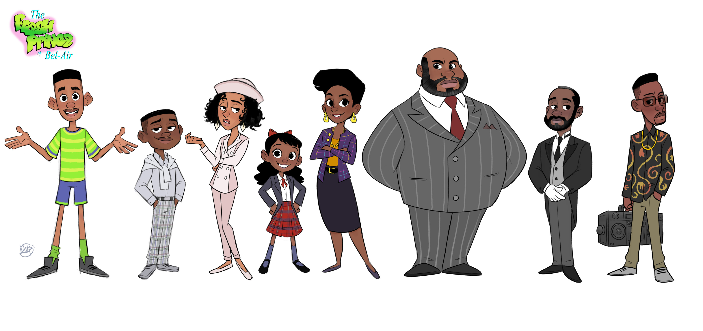

# Fresh Prince of Bel-Air Quiz Game

### Demo: [Fresh Prince of Bel-Air Quiz Game](fresh-prince.surge.sh)
---
## What Does This Project Do?
### A timed-quiz game about the popular 90s tv show, "Fresh Prince of Bel-Air". This game celebrates all the hilarious and sometimes tragic moments-RIP Trevor Collins-Newsworthy!-that took place on the show, but also behind the cameras! 
#

## Instructions
### - There are 5 categories based on the characters,   major plotlines, will's love interests, guest stars, and facts about the show's production. 
### - Version 1.0 of this quiz game will have 10 questions worth 1 point each, timed at 15 second intervals. 
### - No points will be gained or deducted if you miss answering a question in time. 
### - See if you can get all 10 questions right to earn yourself the crown as a true expert fan of the show!

#
## Categories
### - Character's Names: Super easy! Can you name that iconic character from the show?! 
### - Main Plotlines: Most of the show was filled with hilarious moments, some poignant, some tragic then funny again(again, poor Trevor!)
### - Guest Stars: The cast of the show have stated they had worked with each other before the show began, but the show featured lots of famous faces that we've come to know for othere iconic roles after being on this show, some icons before they made a cameo on the show. A certain actress became Will's real life love interest. Can you guess who?
### - Behind the Camera: For the real stans with way too much time on their hands, can you guess some of these very specific show production facts like what network the show was on, that b-boy grip from Episode 67?...ok maybe not that specific!
### - Will's Relationships: Let's face it, Will was a ladies man! Can you correctly match their names and relationship status with Will?
#
## So, why this show...this game?
### I decided to learn to code after watching my 1 year old niece get angry at my ipad because the matching game she was playing wouldn't just play the cat animation everytime she touched the screen. I was curious how games are even built and thought if it were simple enough I could build her a game that was at her level of taste and sophistication! I also wanted to challenge myself so a matching game would be too simple. I live in Will Smith's old neighborhood so I instantly thought of Fresh Prince when I needed a theme for my quiz game.
#
## 
### [Initial Home Screen Wireframe]
#
### [Initial Quiz Screen Wireframe]
#
### [Initial Score Screen Wireframe]
#
## Final Screen Layouts
...
## Languages and Tools Used
### HTML5, CSS3, Javascript, Animate.css, and lots of late-night googling!
#
## Credits
- Luigi Lucarelli(Character Designer) of all the cartoon images used-https://luigil.artstation.com/projects/mq3lL9
- Shoutout to https://www.artofthetitle.com/title/the-fresh-prince-of-bel-air/ for inspiration in color palette based on the show
#

## Icebox
### - Stay tuned for version 2.0 coming soon!
### - More animations and pictures on each screen
### - I'd like to score by category with more "expert" categories having higher points
### - Eventually, I'd like to see this project morph into a trivial pursuit style game that's been updated for millenial pop culture, complete with a digital game board that the user can move around on as they answer questions
#
## Contributions to this Project?
### Any gamers, designers, developers, etc who want to help me expand verions 2.0, get in touch!
#
## Got Questions?
## 
### Feel free to contact Katia Gibson at katiacreator.github.io.

